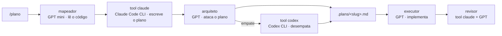

# esteira

Esteira multi-IA com o **[OpenCode](https://opencode.ai)** como maestro.

O OpenCode orquestra, o **Claude e o Codex entram pelos CLIs oficiais** como
ferramentas chamáveis, e a revisão é sempre cruzada: **quem revisa nunca é o
modelo que escreveu**.

Custo adicional: **nenhum**. Roda inteiramente sobre as assinaturas que você já
tem — ChatGPT e Claude — sem API por token.

Este repositório *é* a configuração inteira. Uma máquina nova entra com um comando.

---

## A ideia

Um modelo revisando o próprio trabalho concorda consigo mesmo: erra e valida o
erro pelo mesmo motivo que o cometeu. A esteira quebra isso — cada etapa crítica
roda em uma família de modelo diferente da anterior.

O produto do desacordo é o que interessa. Onde os dois divergem é onde está a
decisão que você precisa tomar de verdade.



---

## Por que o Claude é ferramenta, e não provider

A Anthropic permite o OAuth de assinatura **apenas** no Claude Code e nos apps
nativos dela — usar credencial Pro/Max em harness de terceiro viola os Consumer
Terms e é bloqueado no servidor ([docs oficiais][legal]).

Então o Claude não entra aqui como `anthropic/claude-*`. Ele entra pela
ferramenta `claude`, que chama o **CLI oficial** em modo somente-leitura: dentro
da política, coberto pela assinatura, e ainda por cima carregando as skills,
regras e `CLAUDE.md` do projeto.

Mesma coisa com o `codex`, que chama o Codex CLI em sandbox read-only.

`esteira doctor` falha de propósito se algum agente voltar a apontar para
`anthropic/*`.

[legal]: https://code.claude.com/docs/en/legal-and-compliance

---

## Máquina nova

```bash
curl -fsSL https://raw.githubusercontent.com/Nero-o/esteira/main/install.sh \
  | bash -s -- --repo https://github.com/Nero-o/esteira
```

Ou clonando primeiro:

```bash
git clone https://github.com/Nero-o/esteira ~/.esteira && bash ~/.esteira/install.sh
```

O script instala o `opencode` (e o `claude` e o `codex`, se faltarem), aponta
`~/.config/opencode` para este repo por symlink, instala o comando `esteira` e
valida os agentes. É idempotente e degrada sem travar quando está offline.

Depois, os logins — a **única** coisa que não viaja no git:

```bash
opencode providers login -p openai   # ChatGPT Plus/Pro: move o maestro
claude                               # login do Claude Code CLI, se ainda não fez
codex                                # login do Codex CLI, se ainda não fez
```

**Requisitos:** `git`, `curl` e `bash`. Node/npm é opcional. Testado em Linux e
WSL; deve funcionar em macOS sem ajuste.

---

## Dia a dia

```bash
esteira sync            # ao sentar em qualquer máquina: puxa e reinstala
esteira save "msg"      # depois de mexer na config: commita e envia
esteira status          # o que está instalado, logado e carregado aqui
esteira doctor          # quando algo não funciona
```

O `doctor` compara os modelos que os agentes pedem com os que o login **daquela
máquina** liberou — o jeito mais comum de isso quebrar ao trocar de ambiente.
Cada linha de problema já vem com o comando que resolve.

Trabalhando:

```bash
cd <projeto> && opencode

/plano   adicionar exportação de extrato em CSV
/duelo   vale mais criar tabela nova ou desnormalizar a existente?
/revisar
```

Fora do TUI:

```bash
opencode run --command plano "adicionar exportação de extrato em CSV"
opencode run --agent revisor "revise o diff de HEAD"
```

---

## Papéis

| Agente      | Roda em                | Papel                                    |
|-------------|------------------------|------------------------------------------|
| `arquiteto` | `openai/gpt-5.6-sol`   | maestro; delega, critica, consolida      |
| `mapeador`  | `openai/gpt-5.4-mini`  | lê o codebase, devolve mapa factual      |
| `cetico`    | `openai/gpt-5.3-codex` | ataca um plano, veredito GO/NO-GO        |
| `executor`  | `openai/gpt-5.3-codex` | implementa um passo por vez              |
| `revisor`   | `openai/gpt-5.3-codex` | revisa o diff (passa pelo Claude antes)  |

| Ferramenta | Roda em             | Quando                                  |
|------------|---------------------|-----------------------------------------|
| `claude`   | Claude Code CLI     | raciocínio longo, plano, contraponto     |
| `codex`    | Codex CLI           | desempate, sandbox e skills próprias     |

Trocar de modelo é uma linha `model:` em `opencode/agents/<nome>.md`, seguida de
`esteira save`.

**Sem login OpenAI?** Aponte os agentes para um modelo free do OpenCode Zen
(ex.: `opencode/glm-5-free`) e a esteira segue de pé — o peso está nas
ferramentas, não no maestro.

---

## Atalho: os dois em paralelo

`opencode/bin/segunda-opiniao.sh "pergunta"` roda `codex exec` e `claude -p` ao
mesmo tempo, somente-leitura, e devolve as duas respostas lado a lado. É o que o
comando `/duelo` consome — mais rápido que duas chamadas de ferramenta em série.

---

## Estrutura

```
install.sh                    bootstrap idempotente
bin/esteira                   sync · save · status · doctor
opencode/
  opencode.jsonc              modelos, permissões, MCP, skills
  agents/*.md                 os cinco papéis
  commands/*.md               /plano /duelo /revisar
  tools/claude.ts             ferramenta -> Claude Code CLI
  tools/codex.ts              ferramenta -> Codex CLI
  bin/segunda-opiniao.sh      os dois em paralelo
```

O OpenCode lê `~/.claude/skills` e seus arquivos `CLAUDE.md` / `AGENTS.md`, então
o contexto que você já escreveu para o Claude Code vale aqui sem duplicação.

---

## O que não está aqui

Credenciais. Ficam em `~/.local/share/opencode/auth.json` e nos diretórios dos
CLIs, por máquina, fora do git de propósito. Sessões e histórico também são
locais.

Como este repositório é público, evite colar regra interna de cliente nos `.md`
dos agentes.
