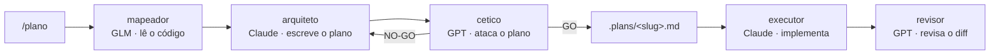

# esteira

Esteira multi-IA com o **[OpenCode](https://opencode.ai)** como maestro.

Claude planeja, GPT ataca o plano, um modelo barato mapeia o código, e a revisão
é sempre cruzada: **quem revisa nunca é o modelo que escreveu**.

Este repositório *é* a configuração inteira. Uma máquina nova entra na esteira
com um comando.

---

## A ideia

Um modelo revisando o próprio trabalho concorda consigo mesmo. Ele erra e valida
o erro pelo mesmo motivo que o cometeu. A esteira existe para quebrar isso:
cada etapa crítica roda em um modelo de família diferente da etapa anterior.

O produto do desacordo é o que interessa — onde os dois divergem é onde está a
decisão que você precisa tomar de verdade.



---

## Máquina nova

```bash
curl -fsSL https://raw.githubusercontent.com/Nero-o/esteira/main/install.sh \
  | bash -s -- --repo https://github.com/Nero-o/esteira
```

Ou clonando primeiro:

```bash
git clone https://github.com/Nero-o/esteira ~/.esteira && bash ~/.esteira/install.sh
```

O script instala o `opencode` (e o `claude` e o `codex`, se faltarem), aponta
`~/.config/opencode` para este repo por symlink, instala o comando `esteira` e
valida os agentes. É idempotente — rodar de novo não quebra nada, e degrada sem
travar quando está offline.

Falta só o login, a **única** coisa que não viaja no git:

```bash
opencode providers login -p anthropic   # opção "Claude Pro/Max": usa sua assinatura
opencode providers login -p openai      # opção ChatGPT Plus/Pro: usa sua assinatura
opencode providers login -p zhipuai     # opcional, GLM
opencode providers login -p moonshotai  # opcional, Kimi
```

**Requisitos:** `git`, `curl` e `bash`. Node/npm é opcional (o instalador cai no
installer oficial do OpenCode se não houver). Testado em Linux e WSL; deve
funcionar em macOS sem ajuste.

---

## Dia a dia

```bash
esteira sync            # ao sentar em qualquer máquina: puxa e reinstala
esteira save "msg"      # depois de mexer na config: commita e envia
esteira status          # o que está instalado, logado e carregado aqui
esteira doctor          # quando algo não funciona
```

O `doctor` compara os modelos que os agentes pedem com os que o login **daquela
máquina** liberou — que é o jeito mais comum de isso quebrar ao trocar de
ambiente. Cada linha de problema já vem com o comando que resolve.

Trabalhando:

```bash
cd <projeto> && opencode

/plano   adicionar exportação de extrato em CSV
/duelo   vale mais criar tabela nova ou desnormalizar a existente?
/revisar
```

Fora do TUI:

```bash
opencode run --command plano "adicionar exportação de extrato em CSV"
opencode run --agent revisor "revise o diff de HEAD"
```

---

## Papéis

| Agente      | Modelo padrão               | Papel                                 |
|-------------|-----------------------------|---------------------------------------|
| `arquiteto` | `anthropic/claude-opus-5`   | maestro; planeja, não implementa      |
| `mapeador`  | `zhipuai/glm-5`             | lê o codebase, devolve mapa factual   |
| `cetico`    | `openai/gpt-5.3-codex`      | ataca o plano, veredito GO/NO-GO      |
| `executor`  | `anthropic/claude-sonnet-5` | implementa um passo por vez           |
| `revisor`   | `openai/gpt-5.3-codex`      | revisa o diff                         |

Trocar de modelo é uma linha `model:` em `opencode/agents/<nome>.md`, seguida de
`esteira save`. Sem credencial do Z.AI, aponte o `mapeador` para
`anthropic/claude-haiku-4-5` ou `moonshotai/kimi-k3` — e se ele falhar mesmo
assim, o `arquiteto` cai no `@explore` nativo e a esteira continua.

---

## Ponte com os CLIs

`opencode/bin/segunda-opiniao.sh "pergunta"` roda `codex exec` e `claude -p` em
paralelo, em modo somente-leitura, e devolve as duas respostas.

Cada CLI entra com as próprias skills, regras e MCPs, usando as **assinaturas**
que você já paga — não API avulsa. É o que o comando `/duelo` consome, e o
`arquiteto` também chama sozinho antes de decisão arquitetural cara.

---

## Estrutura

```
install.sh                    bootstrap idempotente
bin/esteira                   sync · save · status · doctor
opencode/
  opencode.jsonc              modelos, permissões, MCP, skills
  agents/*.md                 os cinco papéis
  commands/*.md               /plano /duelo /revisar
  bin/segunda-opiniao.sh      ponte codex + claude
```

O OpenCode lê `~/.claude/skills` e seus arquivos `CLAUDE.md` / `AGENTS.md`, então
o contexto que você já escreveu para o Claude Code vale aqui sem duplicação.

---

## O que não está aqui

Credenciais. Ficam em `~/.local/share/opencode/auth.json`, por máquina, fora do
git de propósito — OAuth é por máquina e token em repositório é vazamento
esperando acontecer. Sessões e histórico também são locais.

Como este repositório é público, evite colar regra interna de cliente nos `.md`
dos agentes.
